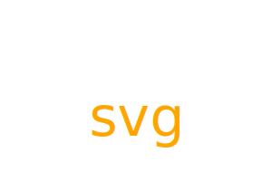

## Challenge-ten-SVG-maker

## Description
This is a project to use node.js and inquirer modules to create a svg logo which the user can design the letter and color by themselves.

## Table of Contents:
 *[Description](#description)
 *[Installation](#installation)
 *[Usage](#usage)
 *[License](#license)

 ## Installation

 To generate your own svg logo, git clone the repo down to your local.

Run npm install on command line to install the following npm package dependencies as specified in the package.

module inquirer will prompt you for your inputs from the command line.

The application will start by running node index.js in the command line.

Answer the prompts in your command line to generate the svg logo.

After answering all the prompts, your file will be named 'samplelogo.svg' and will be ready for you at the root of the repo.

## Usage

node.js inquirer jest html

demo:

https://drive.google.com/file/d/1rdJsdC1_WJ6m7hd0tLbCpGrBoRpoY2jt/view
## License

This project is licensed under the [MIT License]

## Question

if you would like to know more details, please see git@github.com:tanfei0704/challenge-ten-SVG-maker.git.